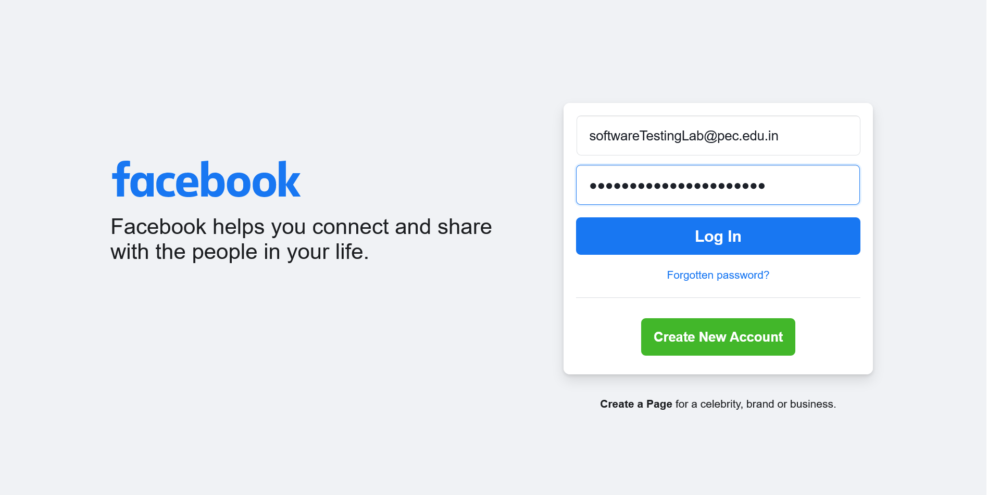
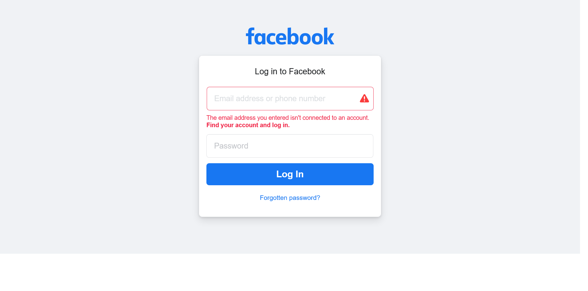
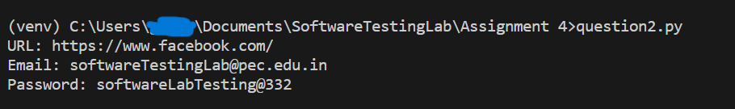
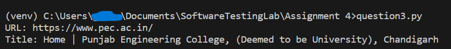

# Assignment 4

## [Question 1](Question_1_Facebook.side)

### Test Cases - 5

1. Login - Successful
2. Login - Fail - Incorrect Email
3. Login - Fail - Incorrect Email and Password
4. Login - Fail - Incorrect Password
5. Logout

## [Question 2](question2.py)

Facebook Login test with incorrect email and correct password

- **[Filled Data](question2_FilledData.png)**
    
- **[Response](question2_UnableToLogin.png)**
    
- **[Console Output](question2_consoleOutput.png)**
    

## [Question 3](question3.py)

Program to print the Page Title

- **[Console Output](question3_consoleOutput.png)**
    

## Question 4

**Note**: Before running the python script make sure to run `pip install requirements.txt` in the current folder to install the required python libraries
